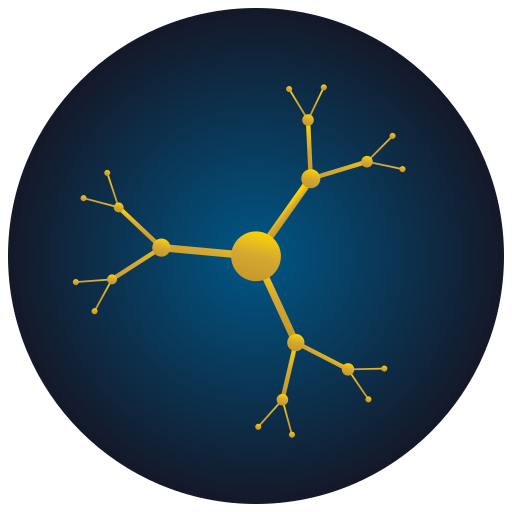

<p align="center">
  
</p>

# Dendrite

A text analysis tool that detects AI-generated content and distinguishes persuasive or rhetorical language from honest, factual writing.

Uses a lattice-based approach to measure structural coherence across 8 levels of abstraction — from individual letters up through words, sentences, paragraphs, sections, chapters, formal structure, and author identity. The compounding of small errors across these layers exposes patterns that generative models cannot conceal.

## Tools

### recognise

Train baseline lattices from human text, then detect both AI-generated content and manipulative rhetoric in samples. Two lattice chains run independently: one trained on organic human text (AI detection), the other on manipulative and rhetorical text (troll detection). AI-generated text typically scores high on both — the safety protocols that shape LLM output produce the same structural patterns as deliberate persuasion.

```
go build -o recognise ./cmd/recognise
```

Train the AI detection lattice from human text:

```
recognise -train -corpus ./texts -memory .recognise_db
```

Train the manipulation detection lattice from rhetorical/manipulative text:

```
recognise -train -corpus ./manipulation_corpus -memory .troll_db
```

Detect AI generation and manipulation in a sample:

```
recognise -detect -memory .recognise_db -troll-memory .troll_db -sample ./input.txt
```

The verdict reports both an AI confidence score (based on walk distance and miss rate through the human lattice) and a manipulation score (structural match against the rhetoric lattice).

Build a fingerprint for a specific LLM model:

```
recognise -fingerprint -model chatgpt -corpus ./chatgpt_texts -memory .recognise_db
```

Flags: `-nodes` (lattice size, default 4096), `-max-steps` (walk budget, default 500), `-passes` (detection depth 1-8, default 4), `-troll-passes` (manipulation detection depth, default 8), `-window` (max tokens per sample, default 500).

### benchmark

Run the full detection benchmark against human text, Claude samples, the RAID corpus (11 LLM models), and optionally live API calls.

```
go build -o benchmark ./cmd/benchmark
```

All-local benchmark (no API keys needed):

```
benchmark -memory .recognise_db \
  -corpus ./gutenberg_corpus \
  -claude-corpus ./claude_corpus \
  -raid ./raid-train.csv
```

With manipulation scoring:

```
benchmark -memory .recognise_db \
  -corpus ./gutenberg_corpus \
  -raid ./raid-train.csv \
  -troll-memory .troll_db
```

Markdown summary output (pipe-friendly):

```
benchmark -memory .recognise_db -corpus ./gutenberg_corpus -raid ./raid-train.csv -summary
```

## Status

Research prototype. Early benchmarks show 69.1% balanced accuracy across 1,600+ samples from human texts, Claude, and the RAID benchmark corpus. See [docs/manifund-proposal.md](docs/manifund-proposal.md) for the full proposal.

## License

MIT
